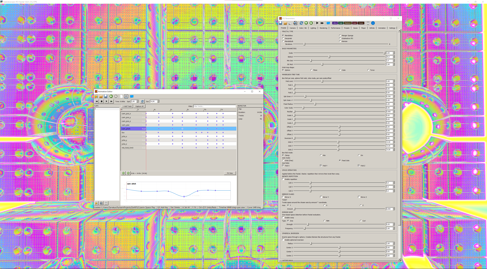
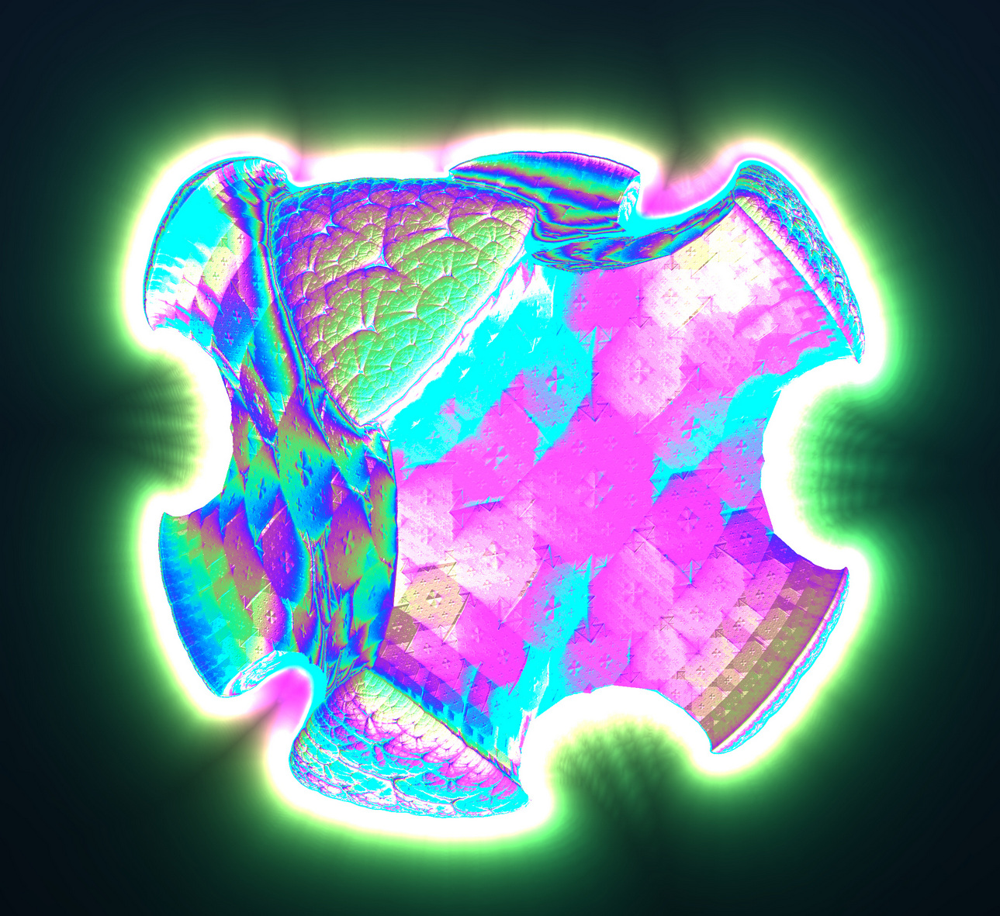
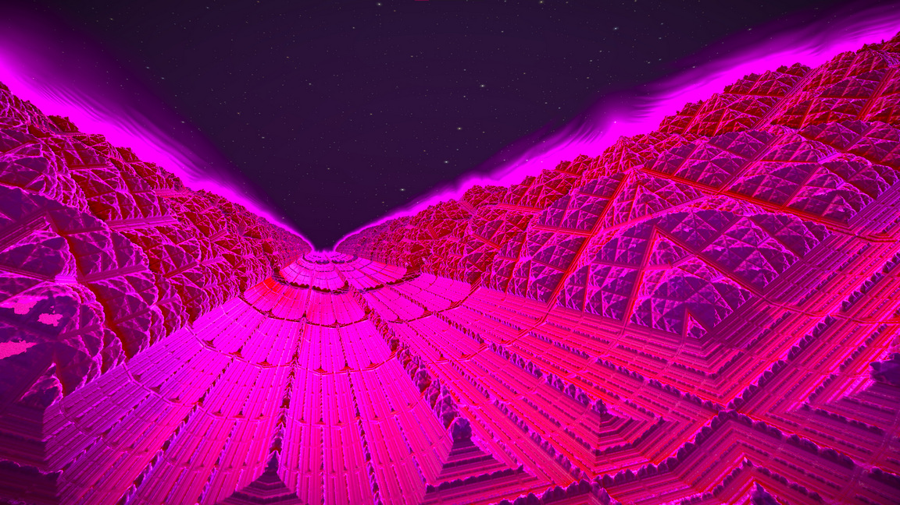
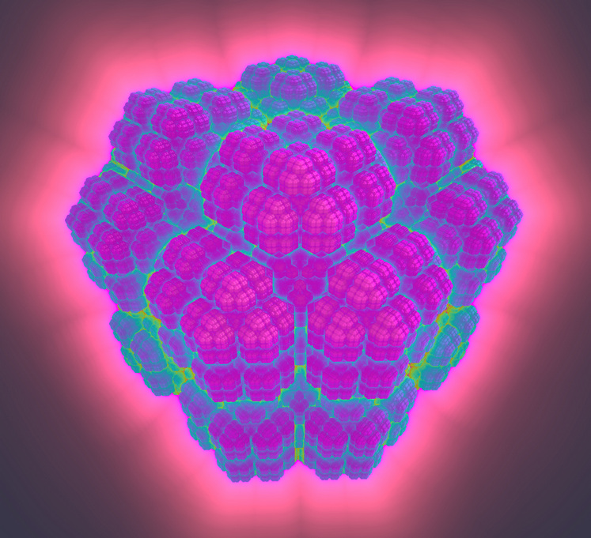
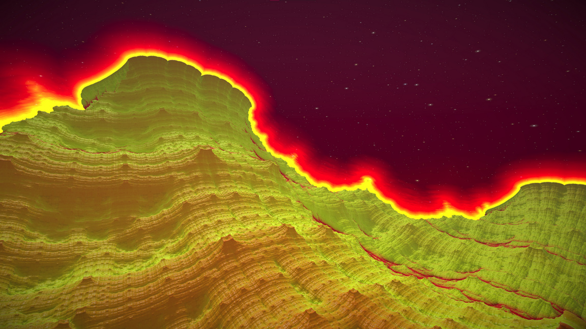

# KIFS Fractal Explorer

Real-time GPU fractal renderer built with Python, ModernGL and PyQt5.
The project focuses on interactive exploration of 3D distance-estimated fractals, procedural lighting, volumetric effects and experimental Kaleidoscopic IFS transformations.

The renderer is designed more like a sandbox than a fixed viewer: almost every part of the fractal pipeline can be modified in real time — folds, rotations, orbit traps, spatial warping, raymarch settings, lighting, post-processing and animation.

---

# Features

* Real-time GLSL raymarching
* Multiple fractal systems:

  * Mandelbox
  * Mandelbulb
  * Menger Sponge
  * Sierpinski Tetrahedron
  * Octahedron IFS
  * Pseudo-Kleinian
* Kaleidoscopic folding operators
* Orbit trap coloring
* Dynamic lighting system
* Soft shadows
* Ambient occlusion
* Reflection and Fresnel shading
* Glow and emissive rendering
* Volumetric fog
* Procedural starfield / nebula backgrounds
* Preset interpolation
* Infinite procedural evolution mode
* Anti-aliasing modes
* Full GPU rendering pipeline
* Real-time parameter editing through GUI

---

# Gallery







---

# Requirements

* Python 3.10+
* OpenGL 3.3 compatible GPU
* Modern graphics drivers

---

# Installation

Install dependencies:

```bash
pip install moderngl moderngl-window numpy PyQt5
```

Run the application:

```bash
python main.py
```

---

# Project Structure

```text
main.py
```

The entire application currently lives in a single file and contains:

* OpenGL shaders
* Fractal distance estimators
* Raymarching pipeline
* GUI controls
* Preset interpolation
* Infinite evolution system
* Post-processing shaders

---

# What Is KIFS?

KIFS stands for **Kaleidoscopic Iterated Function System**.

It is a class of fractal generation techniques built around repeated geometric transformations. Unlike classical escape-time fractals such as the Mandelbrot set, KIFS fractals are usually constructed from repeated spatial folds, reflections, scaling and symmetry operations.

The core idea is surprisingly simple:

1. Take a point in space
2. Apply symmetry operations to it
3. Fold it into a constrained region
4. Scale and offset the result
5. Repeat the process many times

Out of those repeated operations, highly complex self-similar geometry emerges.

---

# The Core Idea Behind KIFS

Traditional Iterated Function Systems often use affine transforms:

```text
p = A * p + b
```

KIFS extends this idea with nonlinear symmetry operators:

* Absolute-value folds
* Plane reflections
* Box folds
* Sphere folds
* Rotational symmetry
* Domain repetition
* Twisting
* Spatial warping

Instead of constructing geometry explicitly, the renderer estimates the distance to the fractal surface through iterative transforms.

That makes KIFS extremely suitable for raymarching.

---

# Kaleidoscopic Folding

The word *kaleidoscopic* comes from the symmetry behavior used in the system.

A simple fold operation:

```glsl
p = abs(p);
```

mirrors all negative coordinates into positive space.

Repeated folds create symmetry groups similar to what happens inside a kaleidoscope.

More advanced folds use clamping:

```glsl
p = clamp(p, -f, f) * 2.0 - p;
```

This operation reflects space across a bounded region and is heavily used in Mandelbox-style fractals.

---

# Distance Estimation

The renderer uses **distance estimation (DE)** instead of polygon meshes.

A DE function approximates how far a point is from the fractal surface.

Example:

```glsl
return length(p) / abs(dr);
```

This value allows the raymarcher to safely advance through space without intersecting geometry.

Advantages:

* Infinite geometric detail
* No mesh generation
* Extremely low memory usage
* Procedural geometry at any scale

Limitations:

* Expensive shader computations
* Requires many iterations
* Numerical instability at extreme zoom levels

---

# Fractal Types

## Mandelbox

The Mandelbox combines:

* Box folds
* Sphere folds
* Uniform scaling

This renderer includes:

* Per-axis fold limits
* Julia mode
* Iterative rotation
* Multiple fold algorithms
* Orbit trap coloring

The Mandelbox is one of the most flexible KIFS systems because tiny parameter changes drastically affect topology.

---

## Menger Sponge

The Menger implementation is based on recursive space subdivision.

The algorithm repeatedly:

1. Mirrors space
2. Sorts coordinate axes
3. Removes cross-shaped regions
4. Scales space

This creates the classic porous sponge structure.

Additional controls include:

* Twist deformation
* Non-uniform scaling
* Cross-width adjustment
* Sharpness blending

---

## Sierpinski Tetrahedron

This fractal repeatedly projects points toward the nearest tetrahedral vertex.

The implementation supports:

* Vertex jitter
* Axis rotation
* Spatial squash
* Fold bias control

Unlike the Mandelbox, the Sierpinski system behaves more like recursive geometric subdivision than nonlinear folding.

---

## Octahedron IFS

The Octahedron IFS is closer to a “pure” KIFS structure.

The algorithm:

* Folds space into octants
* Sorts axes
* Applies recursive scaling
* Offsets geometry toward symmetric regions

This creates sharp crystalline structures with strong kaleidoscopic symmetry.

---

## Mandelbulb

The Mandelbulb extends complex-number fractals into 3D spherical coordinates.

The renderer converts points into polar space:

```glsl
theta = acos(p.z / r);
phi = atan(p.y, p.x);
```

then applies power transformations before converting back into Cartesian coordinates.

This implementation supports:

* Variable power
* Julia mode
* Folding operators
* Adjustable bailout radius

---

## Pseudo-Kleinian

Pseudo-Kleinian fractals combine inversion geometry with folding systems.

The renderer repeatedly applies:

* Spatial clamping
* Sphere inversion
* Recursive scaling

These fractals often produce organic tunnel-like structures and highly detailed cavities.

---

# Rendering Pipeline

The renderer uses a fully GPU-driven raymarching pipeline.

Pipeline overview:

```text
Camera Ray
    ↓
Distance Estimator
    ↓
Raymarch Loop
    ↓
Surface Hit
    ↓
Normal Estimation
    ↓
Lighting & Shading
    ↓
Post Processing
    ↓
Final Image
```

---

# Raymarching

The renderer does not rasterize meshes.

Instead, each pixel shoots a ray into the scene.

The ray advances using the estimated distance:

```glsl
totalDist += d * u_step_scale;
```

If the distance estimator is accurate, the ray can safely skip large empty regions very efficiently.

The process continues until:

* The surface is hit
* The maximum distance is exceeded
* The maximum step count is reached

---

# Normal Calculation

Surface normals are estimated numerically by sampling nearby points.

Full-quality mode:

```glsl
sceneDist(p+vec3(e,0,0)).x - sceneDist(p-vec3(e,0,0)).x
```

This approximates the gradient of the distance field.

Normals are required for:

* Diffuse lighting
* Specular highlights
* Reflections
* Ambient occlusion
* Fresnel effects

---

# Orbit Trap Coloring

Orbit traps are a common fractal coloring technique.

During iteration, the renderer tracks how close points get to certain geometric shapes:

* Sphere
* Plane
* Cube
* Torus

The minimum recorded distance becomes a color parameter.

This produces much richer visual structure than simple iteration-count coloring.

---

# Lighting System

The shader uses a layered lighting model.

Supported effects:

* Diffuse shading
* Specular reflections
* Fresnel reflections
* Rim lighting
* Emission
* Secondary colored light
* Subsurface approximation

The lighting system is intentionally stylized rather than physically accurate.

---

# Ambient Occlusion

Ambient occlusion estimates how enclosed a surface point is.

The renderer samples the distance field along the normal direction:

```glsl
d = sceneDist(p + n*h).x;
```

Areas with nearby geometry become darker.

This greatly improves depth perception inside dense fractal structures.

---

# Soft Shadows

Shadows are raymarched through the distance field.

Instead of binary visibility, the renderer estimates penumbra softness:

```glsl
res = min(res, k * h / t);
```

This creates smoother cinematic shadows.

---

# Spatial Operators

One of the strongest parts of the renderer is the global spatial operator system.

These operators modify space *before* fractal evaluation.

Supported operations:

## Repetition

Tiles space infinitely:

```glsl
p.x = p.x - cell * round(p.x / cell);
```

## Mirror Folds

Mirrors geometry across axes:

```glsl
p.x = abs(p.x);
```

## Twist

Rotates space proportionally to position.

## Warp

Applies sinusoidal or procedural distortions.

These operators can completely transform the visual behavior of a fractal without changing the underlying DE function.

---

# Background Rendering

The renderer includes procedural backgrounds:

* Gradient sky
* Nebula mode
* Starfield mode
* Milky Way approximation

The starfield is generated procedurally using layered hash noise and FBM functions.

No textures are required.

---


# Future Ideas

* Volumetric rendering
* Temporal accumulation
* Signed distance material blending
* VR support
* Animation timeline system
* Node-based fractal graph editor
* Hybrid DE composition

---

# License

MIT License

---
